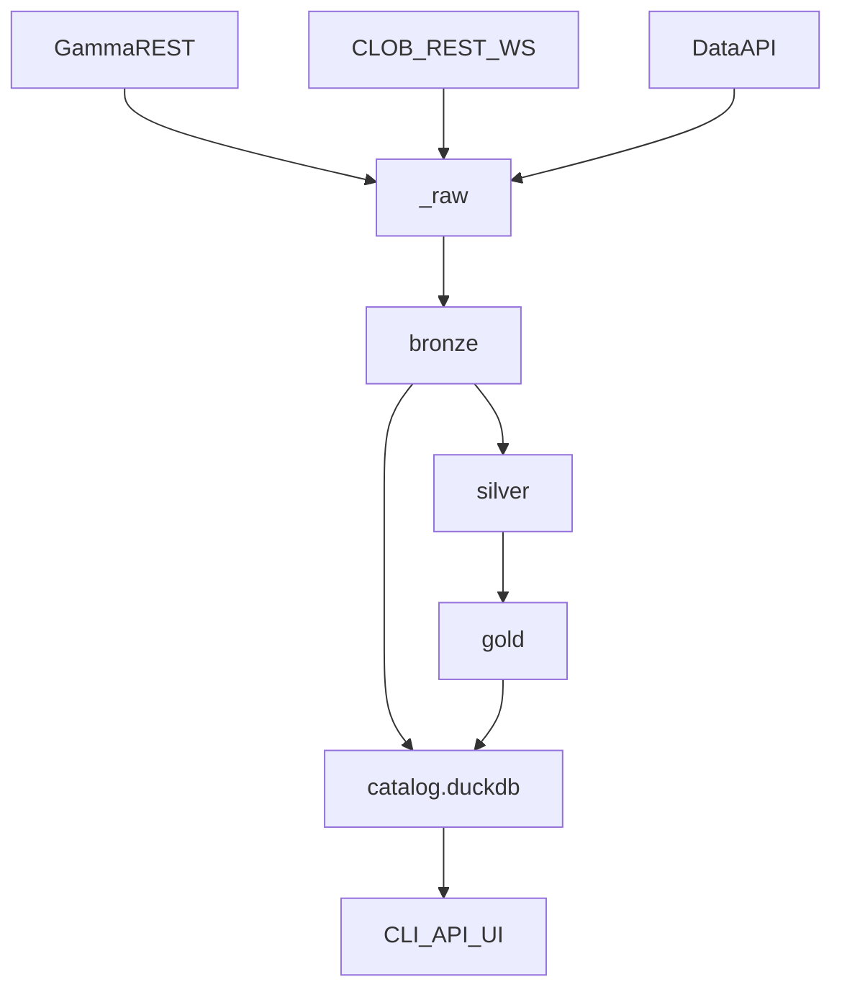

# Architecture

## Module map

See [AGENTS.md](../AGENTS.md) for file-level responsibilities.

## Lake contract

Published at `_metadata/contract.json`. Bump `lake_contract_version()` on breaking schema changes.
