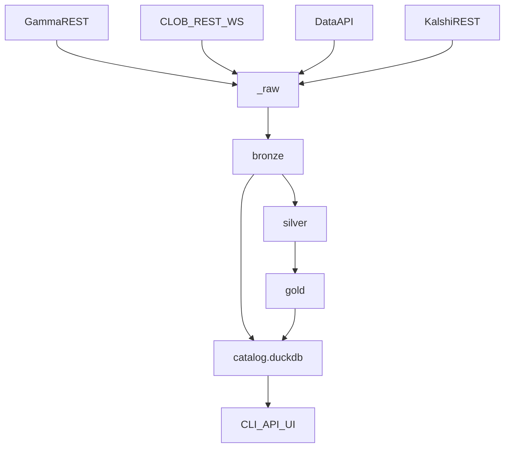

# Architecture

oddsfox is an end-to-end local data lake creator: public source APIs land in `_raw`, become bronze/silver/gold Parquet, are registered in DuckDB, and are exposed through CLI, SQL, HTTP API, and UI.
The current source implementations are Polymarket and Kalshi. Both write the same bronze tables using `source` and prefixed IDs.
Read-only user PnL sync adds `bronze_user_fills`, `bronze_user_positions`, and `gold_user_pnl` for user-supplied Polymarket wallets/proxy addresses and authenticated Kalshi portfolio reads.

## Module map

See [AGENTS.md](../AGENTS.md) for file-level responsibilities.

## Lake contract

Published at `_metadata/contract.json`. Bump `lake_contract_version()` on breaking schema changes.

## Run commit log

`_metadata/runs.parquet` is the local commit log. Sync and compute commands append `started`, then append `complete` only after durable writes finish; handled errors append `failed`. Readers filter run-partitioned bronze tables to completed `run_id`s, so partial runs left by crashes are invisible. Price files are token-partitioned and resume from per-token checkpoints in `_metadata/sync_state.parquet`.

`oddsfox check` reports stale started/failed runs, orphan `run=*` partitions, and leftover temp files. `oddsfox repair` removes temp files and moves orphan run partitions to `_quarantine/orphan_runs/`.
